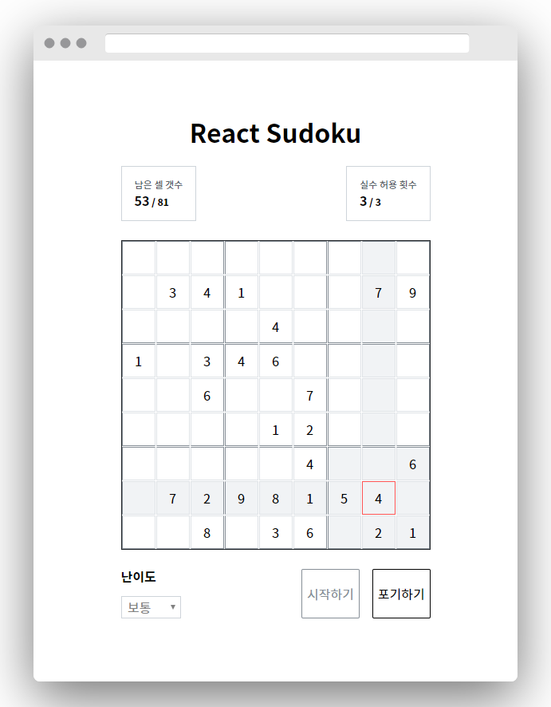

  

# 리액트로 만드는 스도쿠

## 개요

평소 즐겨하는 스도쿠 게임을 따라 만들어보는 프로젝트입니다.

**Thanks to [berto](https://berto.github.io/)'s [Sudoku API](https://github.com/berto/sugoku)**

## 미리보기

[https://react-sudoku.hw0k.now.sh](https://react-sudoku.hw0k.now.sh)

## 과정

- 기본 과정
  1. API를 사용하여 스도쿠 서비스 만들기
  2. Redux 스토어 만들기
  3. 스도쿠 서비스를 이용하는 사가 만들기
  4. 컴포넌트 만들기
  5. 스도쿠 진행 로직 만들기
  6. 배포하기
- 추가 과정
  1. API를 제거하고 순수 만든 스도쿠 로직으로 변경
  2. 스도쿠 로직 서버로 옮기기
  3. 랭킹 시스템 만들기
  4. 일일 스도쿠 만들기
  5. 랜딩 페이지 서버사이드 렌더링하기
  6. 새로 배포하기

## 개발 스택

- TypeScript
- React
- React Router
- Redux
- Redux-saga
- Immer
- Styled Components

## 개발 일지

아래 링크는 Medium Friends Link이므로 읽기 제한에 걸리지 않고 무제한으로 열람하실 수 있습니다 :)

1. [만들기 전](https://medium.com/@hw0knam/d580db8d589e?source=friends_link&sk=10a631e4ead07a3c1e08466504721638)
2. [프로젝트 준비하기](https://medium.com/@hw0knam/e22f91bef37b?source=friends_link&sk=4933cd1b1c2af3f61d4a837af9eef9af)
3. [스도쿠 서비스 만들기](https://medium.com/@hw0knam/cedc558575d5?source=friends_link&sk=eb732d5153d36421886723efc798a3ad)
4. [Redux 스토어 만들기](https://medium.com/@hw0knam/d04a73b5c978?source=friends_link&sk=b681e0869ee0563ed2ab258591f84652)
5. [스도쿠 서비스를 이용하는 사가 만들기](https://medium.com/@hw0knam/9a117597396e?source=friends_link&sk=88393ae8718b059565073c80ff4fde1c)
6. [컴포넌트 만들기](https://medium.com/@hw0knam/1fd7a4f46ee7?source=friends_link&sk=22b6df799935e00704791928571c7266)
7. [게임 로직 담기 & 배포하기](https://medium.com/@hw0knam/ab2b16041b91?sk=a7a809ade7cf207499aff40d1b0343c7)
8. [중간 회고](https://velog.io/@hw0knam/%EB%A6%AC%EC%95%A1%ED%8A%B8%EB%A1%9C-%EB%A7%8C%EB%93%9C%EB%8A%94-%EC%8A%A4%EB%8F%84%EC%BF%A0-8.-%EC%A4%91%EA%B0%84-%ED%9A%8C%EA%B3%A0-18jxb8l7ds)